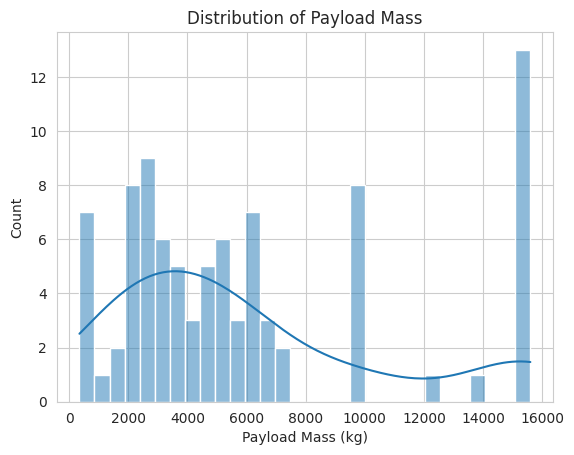
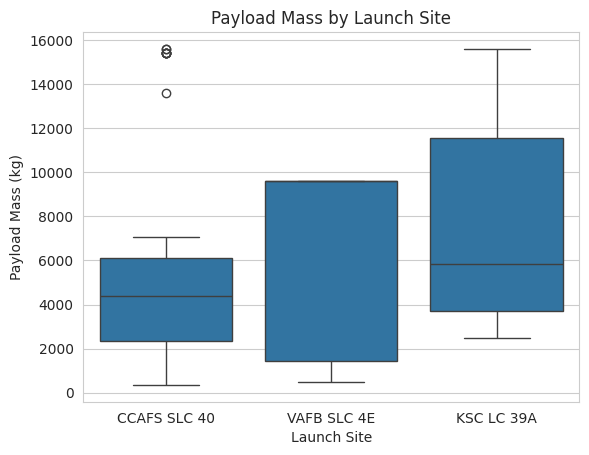
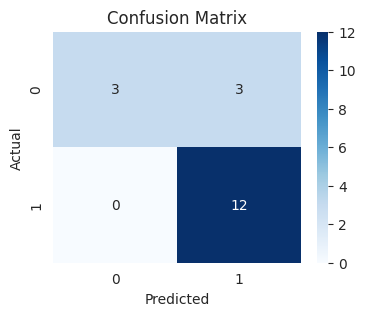

# SpaceX First-Stage Booster Landing Prediction  
*Predicting Falcon 9 booster landing success using machine learning to support cost estimation, operational planning and risk assessment in reusable rocket missions.*

**Dataset:** 90 Falcon 9 launch records  
**Features:** 83 engineered variables  
**Techniques:** EDA, Feature Engineering, Classification Models, Cross-Validation  
**Best Result:** ~83% test accuracy across evaluated models  

---

## Business Context

SpaceX significantly reduced launch costs by **reusing the first stage of Falcon 9 rockets**. However, the economic viability of this strategy depends on whether the booster returns safely after launch.

Predicting landing success can support several operational decisions:

- Estimating mission cost efficiency  
- Assessing operational risk  
- Improving launch planning  
- Understanding factors that influence successful recovery  

From a data perspective, this problem can be framed as a **binary classification task**: predicting whether the booster will land successfully based on mission characteristics.

This project simulates a real analytical scenario where historical launch data is used to generate insights and build predictive models that support **data-driven operational decisions**.

---

## Dataset

The dataset combines information collected from **two primary sources**.

### SpaceX REST API

Data was retrieved using API requests from:

- https://api.spacexdata.com/v4/rockets/
- https://api.spacexdata.com/v4/launchpads/
- https://api.spacexdata.com/v4/payloads/

These endpoints provide structured information about rockets, launchpads and payloads.

### Web Scraping (Wikipedia)

Additional historical launch information was collected through web scraping from:

https://en.wikipedia.org/wiki/List_of_Falcon_9_and_Falcon_Heavy_launches

HTML tables were parsed using **BeautifulSoup** and transformed into structured tabular format.

After cleaning and preprocessing, the final dataset contains:

- **90 launch records**
- **18 original variables**
- **83 engineered features for machine learning**

Key variables used in the analysis include:

- Launch Site  
- Booster Version  
- Payload Mass  
- Orbit Type  
- Flight Number  
- Landing Outcome (target variable)

---

## Problem Statement

Can we predict whether a Falcon 9 first-stage booster will land successfully based on historical launch characteristics?

Solving this problem can help identify operational patterns and support **risk-aware decision making in reusable launch systems**.

---

## Objectives

- Identify key factors influencing booster landing success  
- Perform structured exploratory data analysis (EDA)  
- Engineer relevant features aligned with mission characteristics  
- Build and evaluate classification models  
- Compare different machine learning algorithms  
- Translate analytical results into operational insights  

---

## Methodology

1. **Data Collection**  
   Launch data was obtained through the SpaceX REST API and historical records scraped from Wikipedia.

2. **Data Cleaning and Preparation**  
   Datasets were cleaned, merged and transformed into structured DataFrames suitable for analysis.

3. **Exploratory Data Analysis (EDA)**  
   Statistical analysis and visualizations were used to identify patterns related to landing success.

4. **Geospatial Visualization**  
   Launch sites were visualized using **Folium maps** to provide geographic context for mission operations.

5. **Feature Engineering**  
   Categorical variables were encoded and transformed to build a machine-learning-ready feature matrix.

6. **Model Training and Validation**  
   Multiple classification models were trained and optimized using **GridSearchCV with cross-validation**.

7. **Model Evaluation and Comparison**  
   Models were evaluated using accuracy metrics and confusion matrices.

---

## Tools & Technologies

- Python  
- Pandas  
- NumPy  
- Requests (API data collection)  
- BeautifulSoup (Web scraping)  
- Matplotlib  
- Seaborn  
- Folium (geospatial visualization)  
- Scikit-learn  
- Logistic Regression  
- Support Vector Machines (SVM)  
- Decision Tree Classifier  
- K-Nearest Neighbors (KNN)  
- GridSearchCV  
- StandardScaler  

---

## Exploratory Data Analysis Highlights

The exploratory analysis revealed several structural patterns in Falcon 9 launch operations.

### Payload Mass Distribution

**Figure:** Distribution of payload mass across Falcon 9 missions.

Payload mass shows **large variability**, indicating missions differ significantly in operational complexity.

---

### Payload Mass by Launch Site

**Figure:** Payload mass distribution across different launch sites.

Different launch sites operate with **distinct payload profiles**, suggesting operational specialization.

---

### Flight Number and Landing Success

**Figure:** Relationship between flight number and landing success.

**Landing success increases with higher flight numbers**, reflecting SpaceX's operational learning curve and technological improvements over time.

---

### Launch Site Map

.png)

**Figure:** Geographic distribution of SpaceX launch sites.

Launch operations occur on **both the East and West coasts of the United States**, reinforcing the relevance of geographic context for mission design.

---

## Modeling Approach

This project evaluates multiple machine learning models for predicting landing success.

The models tested include:

- Logistic Regression  
- Support Vector Machine (SVM)  
- Decision Tree Classifier  
- K-Nearest Neighbors (KNN)  

Hyperparameters were optimized using **GridSearchCV with 10-fold cross-validation**.

The dataset was split into **training and test sets** to evaluate generalization performance.

---

## Model Performance

All models produced very similar results.

**Test Accuracy:** ~0.83

| Model | Test Accuracy |
|------|------|
| Logistic Regression | 0.83 |
| SVM | 0.83 |
| Decision Tree | 0.83 |
| KNN | 0.83 |

**Figure:** Confusion matrix illustrating prediction performance.

Although all models show similar accuracy, **Logistic Regression was selected as the preferred model** due to:

- Strong baseline performance  
- Higher interpretability  
- Lower risk of overfitting  
- Easier deployment and explanation  

---

## Key Insights

Several operational insights emerged from the analysis:

**Operational learning curve**  
Landing success increases with flight number, suggesting improved operational maturity over time.

**Mission variability**  
Payload mass varies significantly across launches, indicating different mission profiles and levels of complexity.

**Launch site specialization**  
Different launch sites appear associated with different payload distributions and operational patterns.

**Geographic context**  
Launch location plays a role in mission design and potential landing constraints.

These insights highlight how historical operational data can support **risk assessment and mission planning**.

---

## Business Impact

Potential real-world applications include:

**Operational optimization**  
Predictive models can help estimate the probability of successful booster recovery before launch.

**Cost estimation**  
Since booster reuse reduces launch costs, predicting landing success supports financial planning.

**Risk mitigation**  
Identifying high-risk mission configurations can improve operational preparation.

**Strategic monitoring**  
Model outputs could be integrated into dashboards tracking landing success KPIs.

---

## Limitations

Some limitations should be considered:

- Relatively **small dataset (90 launches)**  
- Limited contextual variables (e.g., weather conditions)  
- Simplified feature set compared to real operational systems  

These constraints limit model generalization but still allow meaningful analytical insights.

---

## Next Steps

Potential improvements include:

- Incorporating **additional launch data**  
- Adding features such as **weather conditions or booster reuse history**  
- Testing **ensemble models (Random Forest, Gradient Boosting)**  
- Building **interactive dashboards for monitoring launch outcomes**  
- Deploying the model in a **cloud environment (AWS / GCP)**  

---

## Strategic Perspective

In this project, analytical decisions were made considering trade-offs between model complexity and interpretability.

My analytical approach is influenced by a cross-cultural perspective developed through years of living and working in different countries. This experience helps me question assumptions, interpret operational contexts and connect data patterns to real-world systems.

---

## Conclusion

This project demonstrates how structured data analysis can transform historical operational data into actionable insights.

Using Falcon 9 launch records, we explored the factors influencing booster landing success and developed predictive models capable of estimating landing outcomes with approximately **83% accuracy**.

Beyond model performance, the focus of this analysis was on **interpretability, operational insight and decision-making relevance**.
